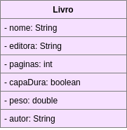
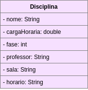
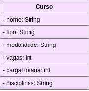
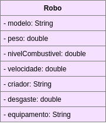

## Livro

No livro temos os seguintes atributos: nome, editora e autor, número total de páginas, presença ou não de capa dura e peso. O contexto pensado foi um programa simples para catalogação de livros.

## Disciplina

 Na disciplina, o contexto pensado foi a de um programa para gerar horários, por isso temos campos como campos de atributos como sala, horário, carga horária e professor.

## Curso

Os atributos da classe curso descrita acima foram baseados nos atributos encontrados na wiki do campus, na página de descrição do curso de engenharia.

## Robo

O contexto pensado para o robô foi de um jogo onde ocorre compra e venda dos mesmos. Nesse caso, atributos como o desgaste, o modelo, a velocidade máxima e o equipamento do robô seriam importantes.
