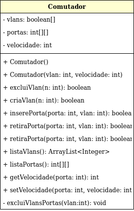

## Comutador

A classe comutador possui 3 atributos (privados): um vetor de boolean para as vlans; uma matriz cujo comprimento é o número total de portas do comutador (ou switch) e o inteiro velocidade.

Entre os métodos da classe, temos os construtores. O construtor básico inicia um objeto da classe Comutador com todos os valores zerados. Nota-se que o número de portas é constante (12) e é representado pelo comprimento da matriz portas, que é inicializado no construtor com 13 colunas e 7 linhas. O número de colunas é 13 pois não utilizamos a localidade 0 da matriz.

No segundo construtor, podemos criar um objeto da classe onde todas as portas iniciam fazendo parte da vlan 1 e com a velocidade passada ao método.

Praticamente todos os outros métodos trabalham modificando os valores da matriz principal (portas) e os valores do vetor vlans.

O método excluiVlansPortas é responsável por, quando excluida uma vlan, retirar todas as portas da vlan excluida. Ele é um método private porque é chamado dentro de excluiVlan e não há necessidade de uso fora do método citado.
